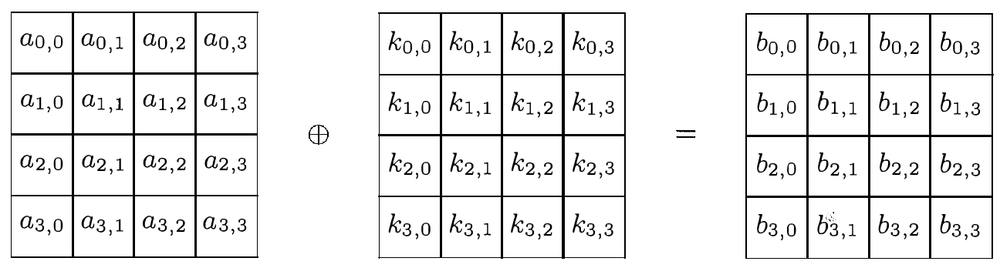

# Overview

The following chapter is based on (fips197) and the authors own knowledge/opinions, if not mentioned otherwise.

# On the usage of optional C keywords
## inline
## const
## restrict
## static

# Functions - constant generators

## Galois field multiplication lookup table generator 

### Description

### Implementation

### Testing

## Sbox generator

### Description

### Implementation

### Testing

# Functions - encryption

## Key Addition

### Description


In this transformation a round key is combined with the state, thus modifying it. The combintation is accomplished using the bitwise XOR operation. The round key array is derived from the initial cipher key using the key schedule. Containing 16 bytes, each round key is equally long to a block. Since there are N+1 round keys generated (where N is the number of rounds), each round uses a different round key.

### Implementation

```c
/*
 * Adds the roundkey to a block.
 */
inline void AddRoundKey(uint8_t * restrict bytes, 
                        const uint8_t * restrict keys)
{
        for(uint8_t i = 0; i < 16; i++) {
                bytes[i] ^= keys[i];
        }
}
```

This function is used to add the current round key to the current block. It takes a restricted pointer to the first byte of the block the cipher is currently operating on and a restricted pointer to a constant, which points to the first byte of the round key, that is supposed to be used currently. It proceeds to combine each of the sixteen bytes of the block with a corresponding byte of the round key designated to the current round using the bitwise XOR. The result is then stored in the block byte used in the XOR operation, meaning that first byte one of the block will be XORed with byte one of the round key and then the result will be stored in place of byte one and so forth for all sixteen bytes.

Since the function is relativly short the 'inline'-keyword is used to save the overhead of an additional function call in tradeoff with a bigger binary.

### Testing

Since the function is fairly simple, it is not covered by the testing suite.

## Shift rows

### Description


(rijndael)(p.37) states, that this transformation of the state represents a byte transposition, using cyclical shifts with different offsets. The first row of the 4x4-Matrix of 16 bytes that constitutes the so called state is not shifted at all, the second row by one step to the left, the third row uses two steps and the fourth row three.

According to (rijndael) this transformation step is needed to ensure optimal diffusion of the state. The diffusion is supposed to protect against differential and linear cryptanalysis. The authors further elaborate the need for that in order to archive optimal diffusion all offsets of the cyclical shifts have to be different.

Since there are multiple possibilities for different offsets and not all of them provided equal protection studies of attacks against Rijndael were analyzed. From the offsets that proved to be the most resistant the simplest offset was chosen.

### Implementation
```c
/*
 * Achieves the AES-ShiftRows by representing it as a series of array-assignments.
 */
void ShiftRows(uint8_t * restrict block, uint8_t * restrict tempblock)
{
        memcpy(tempblock, block, 16 * sizeof(uint8_t));

        block[1] = tempblock[5];
        block[2] = tempblock[10];
        block[3] = tempblock[15];
        block[5] = tempblock[9];
        block[6] = tempblock[14];
        block[7] = tempblock[3];
        block[9] = tempblock[13];
        block[10] = tempblock[2];
        block[11] = tempblock[7];
        block[13] = tempblock[1];
        block[14] = tempblock[6];
        block[15] = tempblock[11];
}
```
The function ShiftRows performs the ShiftRows-transformation on the state. It takes a restricted pointer to the first byte of the block the cipher is currently operating on and a restricted pointer to a temporary block.
First the content of the block is copied into the array the tempblock-pointer is marking. After that the row shifts are represented by assigning the bytes into their positions in the block after the shifts from the tempblock, for example: 

>Since the eleventh byte of the original array (tempblock\[10\]) will (after the rotations) always be in the third spot in the resulting array (block\[2\]) we can simply assign the former to the latter. 
The first byte (tempblock\[0\]) is mapped to itself and therefore is not explicitly "mentioned" in the code, since an assignment to itself would be redundant. 

The result, which is the ShiftRows-transformed state, can now be found in the array marked with the block-pointer and used for further transformations.

'temparray' is passed to the function as a pointer, because allocating the array every time the function is called creates a conciderable overhead.

### Testing


```python
@pytest.mark.parametrize(
    ("input_block", "expected"),
    (
        ("63cab7040953d051cd60e0e7ba70e18c", "6353e08c0960e104cd70b751bacad0e7"),
        ("a761ca9b97be8b45d8ad1a611fc97369", "a7be1a6997ad739bd8c9ca451f618b61"),
        ("3b59cb73fcd90ee05774222dc067fb68", "3bd92268fc74fb735767cbe0c0590e2d")
    )
)
def test_ShiftRows(input_block, expected):
    """Tests the C-implementation of the ShiftRows-function"""
    ba = bytearray.fromhex(input_block)
    reference = bytearray.fromhex(expected)
    byte_array = ctypes.c_ubyte * len(ba)
    temp_array = ctypes.c_ubyte * len(ba)
    aeslib.ShiftRows(byte_array.from_buffer(ba), temp_array.from_buffer_copy(ba))
    assert ba == reference
```

The testfunction for ShiftRows possesses a decorator, which tells pytest what parameters this function is supposed to be tested on. The function itself accepts two variables, one for the input of the ShiftRows-function labeled 'input_block' and a corresponding correct output labeled 'expected', which will be computed from the input, if the ShiftRows-function behaves correctly. Values for both input variables are expected to be strings of 16-byte hex numbers. Those numbers are transformed into two seperate byte arrays, 'ba' and 'reference'. The C-ShiftRows function accepts a pointer to an array of 16 unsigned bytes, which contain the current state and a pointer to an array of 16 unsigned bytes, which can be used as a temporary array. After the ShiftRows function returns, the result of the transformation is contained in the bytearray 'ba'. 'ba' is then compared to 'reference'. pytest will mark this test as passed, when all three comparisons of the transformed 'ba' and 'reference evaluated to true.
The test vectors passed via the decorator are from (fips197) and represent the expected transformations.

## Mix columns

### Description

The MixColumns-transformation is called a bricklayer permutation by (rijndael), which operates on the state-matrix columnwise. The authors mention multiple design criteria, they deemed important for this particular transformation:

1. *The bricklayer transformation is supposed to operate on columns containing 4 bytes.* This aspect is supposed to aid with the optimal implementation of look-up tables on 32-bit architectures, thus ensuring a speedy computation of the transformation.
2. *The operation should be linear over GF(2)*, meaning the Galois Field of the two elements 0 and 1. This property aides the authors in their so-called 'Wide Trail Strategy' (p.126) which is supposed to protect against differential and linear cryptanalysis.
3. *The diffusion achieved by this transformation is supposed to have "relevant" power.* The third property is again supposed to support the 'Wide Tail Strategy'.
4. *The authos put emphasis on the performance of this step on 8-bit CPUs.* They deemed this neccessary, as they feared that the MixColumns transformation would be "the only step that good performance on 8-bit processors is not trivial to obtain for."(p.39)


The transformation itself partitions the state-matrix into four columns. Each of those columns  is transformed independently from the other three. A single column acts as a polynomial over GF(2⁸), which is multiplied modulo x⁴+1 with a fixed polynomial. 
In order to meet the aforementioned criteria regarding performance, diffusion and to fullfill the additional condition of creating an invertible transformation (in regards to encryption) the authors were forced to impose conditions on the fixed polynomials (rijndael). For example, performance was archived by using only simple values for the coefficients of the fixed polynomial.
The fixed polynomial c(x) Daemen and Rijmen settled on is 
c(x) = 03 * x³ + 01 * x² + 01 * x + 02
They state, that since c(x) and the aforementioned modulo x⁴+1 are coprime the calculation is invertible. The matrix-multiplication, which is seen in Fig XXXX, is a representation of the modular multiplication with a fixed polynomial.


158 - 88
4.1.1.
### Implementation
```c
/*
 * Achieves the AES-MixColumns by representing each result byte as a series of
 * table-lookups XORed with each other.
 */
void MixColumns(uint8_t * restrict block, uint8_t * restrict tempblock, 
                const uint8_t (* restrict gal_mult_lookup)[256])
{
        memcpy(tempblock, block, 16 * sizeof(uint8_t));

        for(uint8_t i = 0; i < 16; i += 4) {

                block[i] = gal_mult_lookup[1][tempblock[i]] ^
                        gal_mult_lookup[2][tempblock[i+1]] ^
                        gal_mult_lookup[0][tempblock[i+2]] ^
                        gal_mult_lookup[0][tempblock[i+3]];

                block[i+1] = gal_mult_lookup[0][tempblock[i]] ^
                        gal_mult_lookup[1][tempblock[i+1]] ^
                        gal_mult_lookup[2][tempblock[i+2]] ^
                        gal_mult_lookup[0][tempblock[i+3]];

                block[i+2] = gal_mult_lookup[0][tempblock[i]] ^
                        gal_mult_lookup[0][tempblock[i+1]] ^
                        gal_mult_lookup[1][tempblock[i+2]] ^
                        gal_mult_lookup[2][tempblock[i+3]];

                block[i+3] = gal_mult_lookup[2][tempblock[i]] ^
                        gal_mult_lookup[0][tempblock[i+1]] ^
                        gal_mult_lookup[0][tempblock[i+2]] ^
                        gal_mult_lookup[1][tempblock[i+3]];
        }
}
```

The function MixColumns takes multiple arguments. First it takes a restricted pointer to the first byte of the block the cipher is currently operating on, followed by a restricted pointer to a temporary block and lastly the function gets a restricted pointer to the constant, multi-dimensional GFMLT.
MixColumns starts by copying the current state from 'block' into 'tempblock'. After that it iterates through every row by processing 4 consecutive bytes at a time, before it moves to the following for consecutive bytes of 'block'. Each Byte in 'block' becomes the result of four Galois field multiplications combined through the bitwise XOR-operation, which represents the Galois field addition. The multiplications are implemented as lookups in the GFMLT and combine the coefficients of the fixed polynomial c(x) with the bytes of the current row.
After processing all four rows and returning, MixColumns has written the results of this transformation in place of the current block being processed.

As (rijndael) recommends in chapter 4.1.1 Galois field multiplications were implemented as lookup tables in GFMLT. Since the number of possible multiplication results is highly restricted in GF(2⁸) the table storing all results uses neglibe memory. This avoids computing the multiplications over and over. Furthermore in chapter 10.8.1 the authors suggest, that implementing the multiplications as table lookups makes the algorithm more resistant to timing attacks, since the finite field multiplication performed in MixColumns is the only operation in Rijdael that is not computed in constant time. 
In their 8-bit implementation in chapter 4.1.1 they suggest only generating a table where table[a] = 02 * a, since multiplication with one is the factor itself and multiplication with three can be efficiently archived by XORing the result of the multiplication with two with the original number: 
03 * a = (02 * a) ^ a
To avoid leaking more timing data than absolutely neccessary the present implementation uses a lookup table for all values, since this ensures that for each multiplication the CPU (theoretically) does always the exact same amount of work, thus ensuring it always takes the exact same amount of time. This size increase by 2 * 256b = 512 bytes (compared to the suggested implementation with only one row) is negligible for our target of x86-CPU-system, which today typically feature memory sizes in the gigabyte range.
(rijndael) did not make a mistake in their implementation suggestion though, since the small lookup table variant was only suggested for memory constrained 8-bit enviroments. For 32-bit-architectures or wider they make even more extensive use of lookup tables than the present implementation does (compare ch. 4.2). This variant has not been used, since it reduces the steps of the algorithm for each column in each round into four table lookups accessing large tables crafted for this purpose, and four XOR operations concatenating the lookup-results. This obscures the original layout of the algorithm heavily and we wished for it to be recognizable in our implementation.

In the end the suggestions (rijndael) makes regarding this topic have to be taken with a grain of salt, since the extensive use of lookup tables seems to enable new side channel attack vectors as previously discussed.

### Testing

```python
<# Vectors from [FIPS 197] Appendix C, Rounds 1, 2, 3
@pytest.mark.parametrize(
    ("input_block", "expected"),
    (
        ("6353e08c0960e104cd70b751bacad0e7", "5f72641557f5bc92f7be3b291db9f91a"),
        ("a7be1a6997ad739bd8c9ca451f618b61", "ff87968431d86a51645151fa773ad009"),
        ("3bd92268fc74fb735767cbe0c0590e2d", "4c9c1e66f771f0762c3f868e534df256")
    )
)
def test_MixColumns(input_block, expected):
    """Tests the C-implementation of the MixColumns-function"""
    ba = bytearray.fromhex(input_block)
    reference = bytearray.fromhex(expected)
    byte_array = ctypes.c_ubyte * len(ba)
    temp_array = ctypes.c_ubyte * len(ba)
    gal_mult_lookup_array = ctypes.c_ubyte * len(gal_mult_lookup)
    aeslib.MixColumns(byte_array.from_buffer(ba), temp_array.from_buffer_copy(ba),
                      gal_mult_lookup_array.from_buffer(gal_mult_lookup))
    assert ba == reference
```

Like other testing functions the test vectors for pytest to review are provided via decorator. They are copied from (fips197) to ensure correctness. 
The function takes one argument which represents the state before a MixColumns transformation and one argument, which represents the state after said transformation. Both are expected to be strings containing the bytes encoded in hexadecimal notation. 'input_block' gets converted to the bytearray 'ba' and is then passed along with another temporary sixteen-byte-array on towards the C-implementation of the MixColumns-function. After the latter function returns, ba contains the result of the desired transformation. pytest now compares each output state to the corresponding test vector value to determine if the MixColumns-implementation works correctly.

## Substitute bytes

### Description


Being the only non linear transformation, SubBytes is labeled a bricklayer permutation by (rijndael) that applies byte substitution to each byte of the state. This substitution is facilitated throught the AES Sbox, which was already discussed in more detail earlier.
AES uses only this one Sbox, although the authors mention, that Rijndael "could as easily be defined with different S-boxes for every byte." (p.35). They descided against it, because one key criteria during the developement process for them was simplicity (ch. 5.2). Rijmen and Daemen argue, that simplicity is an important contributer towards a correct implementation, that it helps to get more people to review it, since it is easier than reviewing more complex software and that it may aide the notion it is easier to attack, thus motivating more of such attacks. They further elaborate that the latter two points contribute to the cryptographic credebility of the algorithm, especially if out of many tries no successful attack can be mounted. Furthermore simpicity as a design criterion was used to balance the security with the factors efficiency and versatility.
This simplicity was partially archived by designing the algorithm following the principle of what they call "symmetry". Their tenet of symmetry within the round transformation (ch. 5.3.2) " implies that it treats all bits of the state in a similar way." (p.66). They explain that this imposes some restrictions, amongst others the requirement to use only one sbox for the whole state in their non-linear step. Symmetry across all rounds (ch. 5.31.) dictates that all rounds have to be identical. This keeps the specification and implementation short, since only one round has to be described/expressed in code. This tersness in definition is also of benefit for hardware implementations, since there has to be only one circuit designed to implement all rounds, instead of one circuit per round. This tersness also has the consequence, that only one Sbox can be used for all rounds (contrary to DES (XXX)).

### Implementation
```c
/*
 * Substitutes all bytes in a block with bytes from a sbox.
 */
inline void SubBytes(uint8_t * restrict bytes, const uint8_t * restrict sbox)
{
        for(uint8_t i = 0; i < 16; i++) {
                bytes[i] = sbox[bytes[i]];
        }
    
}
```
The SubBytes-implementation is pretty straightforward. The function recieves two restricted pointers, one called 'bytes', pointing to the first byte of the current state, and one pointer to a constant array, which contains the sbox to be used. The function now iterates through 'bytes', assigning every element from that array a new value by accessing the element of the 'sbox'-array, which corresponds to the value in the current 'bytes' element.

### Testing

Since the function is fairly simple, it is not covered by the testing suite.

## Full block encryption

### Description

To encrypt one block of AES the whole cipher with all rounds has to be executed. One round consists of four steps, which represent the four transformation employed in the encryption algorithm. The order of those transformations for each round r is:

1. SubBytes
2. ShiftRows
3. MixColumns
4. AddRoundKey

If N is the number of rounds specified by the encryption standard then the algorithm will execute N-1 * r, while the Nth round omits the MixColumns step, but is otherwise identical. Before the first round one additional AddRoundKey is performed on the state.

### Implementation
```c
void encryptBlock(uint8_t * restrict block, uint8_t * restrict tempblock, 
                  const uint8_t * restrict keys, const uint8_t rounds, 
                  const uint8_t * restrict sbox, 
                  const uint8_t (* restrict gal_mult_lookup)[256])
{   
        uint8_t ikeys = 0;
        AddRoundKey(block, keys);
        ikeys += 16;

        for(uint8_t i = 0; i < rounds - 1; i++) {   
                SubBytes(block, sbox);
                ShiftRows(block, tempblock);
                MixColumns(block, tempblock, gal_mult_lookup);
                AddRoundKey(block, &keys[ikeys]);
                ikeys += 16;
        }
        
        SubBytes(block, sbox);
        ShiftRows(block, tempblock);
        AddRoundKey(block, &keys[ikeys]);
}
```

The present implementation of the Cipher takes multiple arguments. Like in all other functions a restricted pointer to the first element in the state array is provided. The second argument is a restricted pointer to another bytearray of length sixteen, that can be used to store temporary values. The third argument is a restricted pointer to a constant bytearray, which contains the roundkeys. The next argument is a constant byte denoting the number of rounds for the algorithm. It is passed to provide future extensebility in case different key lengths are used and thus different round numbers are needed, since this number depends on the key length. The fifth argument is a restricted pointer to a constant array containing the S-box values. The last argument is a restricted pointer to a constant, multidimensional array containing the GLFMLT.

The function begins by allocation an unsigned byte on the stack and assigning it the value of zero. This variable keeps track of the first byte of the next key that is to be used in the function AddRoundKey, thus has to be incremented by 16 after every call to the AddRoundKey-function. The name is derived from "**i**ndex of the round**keys**".
Next the AddRoundKey-function is called with the pointer to the current state and a pointer to the first round-key, which is followed by the first increase of the 'ikeys'-variable.
Now the rounds are executed in a for-loop, that counts from zero to the number of rounds minus one.
Every round consists of the following steps: SubBytes is called with a pointer to the current state and a pointer to the sbox, followed by a call of ShiftRows with a pointer to the current state and the tempblock, then a call of MixColumns with pointers to the current state, the temporary block and the GFMLT. Now comes a call to AddRoundKey with a pointer to the current state and the memory address 'keys' would point towards, if it was increased by the amount stored in 'ikeys'. The latter passes on the starting address of the bytearray of the next round key to be used by AddRoundKey. The last part of each round is the increase of the 'ikeys'-counter.
After exiting the loop the function executes one more round without the call to MixColumns and the increase of the 'ikeys'-counter variable and then it returns.

### Testing

```python
@pytest.mark.parametrize(
    ("plaintext", "key", "expected"),
    (
        (
            "3243f6a8885a308d313198a2e0370734",
            "2b7e151628aed2a6abf7158809cf4f3c",
            "3925841d02dc09fbdc118597196a0b32"
        ),
    )
)
def test_EncryptBlock(plaintext, key, expected):
    """Tests the C-implementation of the AES-Encryption of a single block"""
    ba = bytearray.fromhex(plaintext)
    byte_array_block = ctypes.c_ubyte * len(ba)

    reference = bytearray.fromhex(expected)
    baKey = expand_key(key)
    byte_array_key = ctypes.c_ubyte * len(baKey)

    temp_array = ctypes.c_ubyte * len(ba)
    sbox_array = ctypes.c_ubyte * len(sbox)
    gal_mult_lookup_array = ctypes.c_ubyte * len(gal_mult_lookup)
    

    aeslib.encryptBlock(byte_array_block.from_buffer(ba), temp_array.from_buffer_copy(ba),
                        byte_array_key.from_buffer(baKey), 10, sbox_array.from_buffer(sbox),
                        gal_mult_lookup_array.from_buffer(gal_mult_lookup))
    assert ba == reference
```

Our first function to test the correctness of our cipher is marked with a pytest-decorator, that contains a testvector from (fips197). The function itself takes three arguments, one called 'plaintext', one called 'key' and one called 'expected'. All three are supposed to contain a hexadecimal representation of bytesequences in a string format.
The function starts by converting 'plaintext' and 'expected into bytearrays. It then generates the round keys from 'key' by calling the function expand_key.
The 'encryptBlock' function now recieves all neccessary arguments via the ctypes-interface, namely the plaintext-bytearray, a temporary array, the bytearray containing the expanded keys, the number of rounds, the S-box array generated with one of the generator functions and the GLFMLT array, which has been generated before like the S-box.
pytest marks this test as passed, when the encrypted bytearray matches the bytearray generated from the 'expected'-value of the testvector.

```python
def test_EncryptBlockRandom():
    """
    Tests the C-implementation of the AES-Encryption of an arbitrary number of individual blocks.
    Plaintext and Key are randomized each time.
    """
    ba = bytearray(16)
    byte_array_block = ctypes.c_ubyte * len(ba)
    key = bytearray(16)
    baKey = bytearray(176)
    byte_array_key = ctypes.c_ubyte * len(baKey)
    temp_array = ctypes.c_ubyte * len(ba)
    sbox_array = ctypes.c_ubyte * len(sbox)
    gal_mult_lookup_array = ctypes.c_ubyte * len(gal_mult_lookup)
    for i in range(100): #arbitrary number of rounds
        key = urandom(16)
        baKey = expand_key(key.hex())
        b = urandom(16)
        ba = bytearray(b)
        aes_reference = pyaes.AESModeOfOperationECB(key)
        reference = aes_reference.encrypt(b)
        aeslib.encryptBlock(byte_array_block.from_buffer(ba), temp_array.from_buffer_copy(ba),
                        byte_array_key.from_buffer(baKey), 10, sbox_array.from_buffer(sbox),
                        gal_mult_lookup_array.from_buffer(gal_mult_lookup))
        assert ba == reference
```

The second test generates an arbitrary amount of random plaintexts and keys (in the present version of the implementation 100 of each) and compares them against a reference implementation of AES, in our case the 'pyaes'-library (XXX).
The first part is nearly identical to the previous test function. After setting up all the byte arrays the function enters a loop though. For every iteration Python fills the key-bytearray and the plaintext-bytearray with 16 random bytes each. It uses the urandom-function from the os library (XXX) to generate those random bytes. The byte-sequences are now processed independently by the pyaes implementation (in electronic codebook mode) and the present implementation.
This function is marked as passed, when the encryptions initialized with random plaintexts and key pass for every iteration. To create a more throrough version of the test one can increase the number of iterations at expense of decreased performance.
This test is used in addition to the normal test, because it ensures the implementation and all of its components (for example SubBytes) can not only handle the testvector, but all possible values that fulfill the requirements.

## Encryption of multiple consecutive blocks

### Description

Although not explicitly required in context of this work, the present implementation contains the possibility to encrypt multiple consecutive blocks. With that it enables encryption of for example messages larger than sixteen bytes or even files. 
This is an implementation of the simplest Block Cipher Modes of Operation, called 'Electronic Codebook Mode'.

The bye array containing the plaintext has to be padded though, as only byte arrays with length l can be processed where l modulo 16 equals 0. Padding can be implemented in multiple ways, this implementation does it as follows:

```python
def pad_input(ba):
    """pads bytearray to have a length % 16 = 0"""
    topad = 16 - len(ba) % 16
    if topad == 0:
        topad = 16 #ensures that last byte is always padding
    padding = bytearray([topad] * topad) # PKCS 5, 7
    return ba + padding
```

First it decides how many bytes the passed array is missing until the length l of the array fulfills the requirement l modulo 16 equals 0. The number of missing elements m is then appended m times to the array in need of padding. If no padding is required a whole block gets padded. This ensures the last byte of the decrypted string always contains the information on how many bytes are padded and need to be removed, since without this procedure a value for the last byte of one would be ambiguous: does the last byte need to be removed since it is padding of one or is it part of the message?
This follows the concept of (PKCS #7 RFC2315).

> The array containing the plaintext is 357 bytes long. Since 357%16 = 5, five bytes need to be added to the plaintext array. The present implementation then adds an array containing the values {5, 5, 5, 5, 5} to the array.

### Implementation

```c
/*
 * Initializes the constant tables sbox, galois-field-multiplication-lookup and keys.
 * Performs AES-encryption on multiple, consecutive blocks.
 */
void encryptAES(uint8_t * restrict bytes, uint8_t * restrict initval, 
                   const size_t bytecount, const uint8_t rounds)
{   
        uint8_t sbox[256];
        uint8_t gal_mult_lookup[3][256];
        for(size_t i = 0; i < 256; i++) {
                sbox[i] = *initval++;
        }
        for(size_t i = 0; i < 3; i++) {
                for(size_t j = 0; j < 256; j++) {
                gal_mult_lookup[i][j] = *initval++;
                }
        }
        
        const uint8_t *keys = initval;
        uint8_t tempblock[16];
        
        for(size_t i = 0; i < bytecount; i += 16) {
                encryptBlock(&bytes[i], tempblock, keys, 
                             rounds, sbox, gal_mult_lookup);
        }
}
```
The function takes four arguments. The first one is a restricted pointer to an array containing the bytes that need to be encrypted. The second argument is a restricted pointer to an array containing the initialization values: first the elements of the S-box, followed by the bytes of the GFMLT, while the rest are the bytes of the round keys. The third is a constant unsigned variable which width equals the wordwidth of the CPU architecture the source code gets compiled on. The last argument is a constant byte containing the number of rounds.
The function starts by allocation an array of 256 unsigned bytes called 'sbox'. After that another array named 'gal_mult_lookup' is allocated, but this time it is two-dimensional, using three times 256 unsigned bytes. The name is derived from '**Gal**ois field **mult**iplication **lookup**table'. Both are initalized with the three following for-loops. The first loop reads the first 256 bytes from 'initvar' and assigns them to 'sbox'. The following two nested for-loops iterate through the two dimensions of 'gal_mult_lookup' and assign the results of the Galois field multiplications in GF(2⁸) to the respective dimensions of the array. The first dimension denotes the multiplicator m. m - 1 accesses the right array, while the second dimension accesses the result for the value wanted.

> The program needs to compute the multiplication of two times 114. This means it has to access gal_mult_lookup[2-1]. For the result it simply needs to use the second factor as the array index for the second dimension. Thus the final array access to calculate 2 * 114 in GF(2⁸) is gal_mult_lookup\[2\]\[114\]. For 3 * 86 it would be gal_mult_lookup\[2\]\[86\] etc.

After populating the arrays the pointer has moved far enough through 'initvals' that it now points to the first byte of the first round key. To make this more clear and to enable possible compiler optimisations we create a new pointer named 'keys' poining to a constant array, which is in this case 'initvals'. All future accesses to this array will be throught 'keys' or descendants of this pointer. The last step before starting the encryption routine is the creation of an array of sixteen unsigned bytes called 'tempblock'.
The next for loop starts the encryption. Every iteration processes one block and increments the loop index variable by sixteen, so that it can point to the next block to be processed. In every iteration of this loop the function 'enrcryptBlock' is called with the address of the current block to encrypt, a pointer to the temporary block, a pointer to the array containing the round keys, a variable containing the number of rounds, a pointer to the sbox and a pointer to the GFMLT.

Since parallelisation of the de- and encryption routine seems to be a worthwhile endeavour for the future, this function was already designed with that in mind. An allocation of the temporary block as a local variable instead of a global one avoids the need for thread synchronization, since every thread would use their own temporary block, if every thread spawned would use this function as a starting point.
### Testing

```python
def test_encrypt_aes():
    """Tests the C-implementation of the AES-Encryption on multiple, consecutive, random Blocks.
    """
    no_bytes = 2**15 #arbitrary number of bytes (has to be divisible by 16)
    ba = bytearray(no_bytes)
    byte_array_block = ctypes.c_ubyte * len(ba)
    key = bytearray(16)
    baKey = bytearray(176)
    initvals = bytearray(len(sbox) + len(gal_mult_lookup) + len(baKey))
    byte_array_initvals = ctypes.c_ubyte * len(initvals)
    for i in range(20): #arbitrary number of rounds
        key = urandom(16)
        baKey = expand_key(key.hex())
        initvals = sbox + gal_mult_lookup + baKey
        b = urandom(no_bytes)
        ba = bytearray(b)
        aes_reference = pyaes.AESModeOfOperationECB(key)
        aeslib.encryptAES(byte_array_block.from_buffer(ba),
                        byte_array_initvals.from_buffer(initvals), len(ba), 10)

        i = 0
        while (i < no_bytes):
            current_reference = aes_reference.encrypt(b[i:i+16])
            current_ba = ba[i:i+16]
            assert current_ba == current_reference

            i += 16
```

This testfunction is similar to the previously discussed 'test_EncryptBlockRandom'. The major difference is that this function is not resticted to testing sixteen bytes at a time. by adjusting 'no_bytes' one can test as many consecutive blocks as memory and patience permit. The for-loop again allows for automatic repetition of this test to ensure the tested function can handle all byte permutation within the specified range.
Since the 'pyaes'-library does not allow for encryption of multiple consecutive blocks, a while-loop had to be added in the end, that allows this external library to encrypt one block at a time and compare it afterwards to the results of the present implementation, which encrypts all blocks in one go.
---
* CPU central processing unit
* GFMLT Galois-Field multiplication lookup table
* GF(2⁸) Galois field...


´
