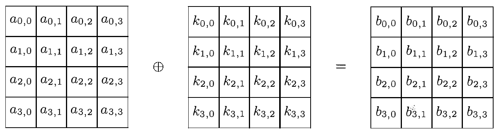
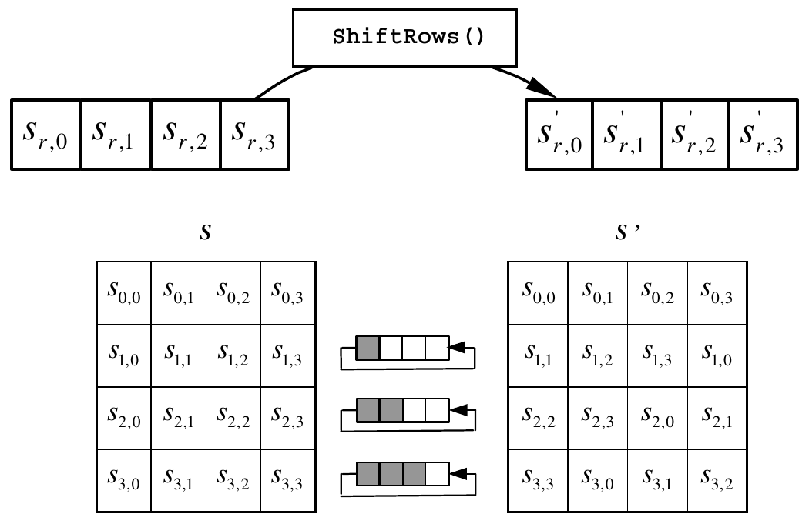

# Overview

The following chapter is based on (fips197) and the authors own knowledge/opinions, if not mentioned otherwise.

# On the usage of optional C keywords
## inline
## const
## restrict
## static

# Functions

## Key Addition

### Description


In this transformation a round key is combined with the state, thus modifying it. The combintation is accomplished using the bitwise XOR operation. The round key array is derived from the initial cipher key using the key schedule. Containing 16 bytes, each round key is equally long to a block. Since there are N+1 round keys generated (where N is the number of rounds), each round uses a different round key.

### Implementation

```c
/*
 * Adds the roundkey to a block.
 */
inline void AddRoundKey(uint8_t * restrict bytes, 
                        const uint8_t * restrict keys)
{
        for(uint8_t i = 0; i < 16; i++) {
                bytes[i] ^= keys[i];
        }
}
```

This function is used to add the current round key to the current block. It takes a restricted pointer to the first byte of the block the cipher is currently operating on and a restricted pointer to a constant, which points to the first byte of the round key, that is supposed to be used currently. It proceeds to combine each of the sixteen bytes of the block with a corresponding byte of the round key designated to the current round using the bitwise XOR. The result is then stored in the block byte used in the XOR operation, meaning that first byte one of the block will be XORed with byte one of the round key and then the result will be stored in place of byte one and so forth for all sixteen bytes.

Since the function is relativly short the 'inline'-keyword is used to save the overhead of an additional function call in tradeoff with a bigger binary.

### Testing

## Shift rows

### Description


(rijndael)(p.37) states, that this transformation of the state represents a byte transposition, using cyclical shifts with different offsets. The first row of the 4x4-Matrix of 16 bytes that constitutes the so called state is not shifted at all, the second row by one step to the left, the third row uses two steps and the fourth row three.

According to (rijndael) this transformation step is needed to ensure optimal diffusion of the state. The diffusion is supposed to protect against differential and linear cryptanalysis. The authors further elaborate the need for that in order to archive optimal diffusion all offsets of the cyclical shifts have to be different.

Since there are multiple possibilities for different offsets and not all of them provided equal protection studies of attacks against Rijndael were analyzed. From the offsets that proved to be the most resistant the simplest offset was chosen.

### Implementation
```c
/*
 * Achieves the AES-ShiftRows by representing it as a series of array-assignments.
 */
void ShiftRows(uint8_t * restrict block, uint8_t * restrict tempblock)
{
        memcpy(tempblock, block, 16 * sizeof(uint8_t));

        block[1] = tempblock[5];
        block[2] = tempblock[10];
        block[3] = tempblock[15];
        block[5] = tempblock[9];
        block[6] = tempblock[14];
        block[7] = tempblock[3];
        block[9] = tempblock[13];
        block[10] = tempblock[2];
        block[11] = tempblock[7];
        block[13] = tempblock[1];
        block[14] = tempblock[6];
        block[15] = tempblock[11];
}
```
The function ShiftRows performs the ShiftRows-transformation on the state. It takes a restricted pointer to the first byte of the block the cipher is currently operating on and a restricted pointer to a temporary block.
First the content of the block is copied into the array the tempblock-pointer is marking. After that the row shifts are represented by assigning the bytes into their positions in the block after the shifts from the tempblock, for example: 

>Since the eleventh byte of the original array (tempblock\[10\]) will (after the rotations) always be in the third spot in the resulting array (block\[2\]) we can simply assign the former to the latter. 
The first byte (tempblock\[0\]) is mapped to itself and therefore is not explicitly "mentioned" in the code, since an assignment to itself would be redundant. 

The result, which is the ShiftRows-transformed state, can now be found in the array marked with the block-pointer and used for further transformations.

### Testing

## Mix columns

### Description

### Implementation
```c
/*
 * Achieves the AES-MixColumns by representing each result byte as a series of
 * table-lookups XORed with each other.
 */
void MixColumns(uint8_t * restrict block, uint8_t * restrict tempblock, 
                const uint8_t (* restrict gal_mult_lookup)[256])
{
        memcpy(tempblock, block, 16 * sizeof(uint8_t));

        for(uint8_t i = 0; i < 16; i += 4) {

                block[i] = gal_mult_lookup[1][tempblock[i]] ^
                        gal_mult_lookup[2][tempblock[i+1]] ^
                        gal_mult_lookup[0][tempblock[i+2]] ^
                        gal_mult_lookup[0][tempblock[i+3]];

                block[i+1] = gal_mult_lookup[0][tempblock[i]] ^
                        gal_mult_lookup[1][tempblock[i+1]] ^
                        gal_mult_lookup[2][tempblock[i+2]] ^
                        gal_mult_lookup[0][tempblock[i+3]];

                block[i+2] = gal_mult_lookup[0][tempblock[i]] ^
                        gal_mult_lookup[0][tempblock[i+1]] ^
                        gal_mult_lookup[1][tempblock[i+2]] ^
                        gal_mult_lookup[2][tempblock[i+3]];

                block[i+3] = gal_mult_lookup[2][tempblock[i]] ^
                        gal_mult_lookup[0][tempblock[i+1]] ^
                        gal_mult_lookup[0][tempblock[i+2]] ^
                        gal_mult_lookup[1][tempblock[i+3]];
        }
}
```
### Testing

## Substitute bytes

### Description
```c
/*
 * Substitutes all bytes in a block with bytes from a sbox.
 */
inline void SubBytes(uint8_t * restrict bytes, const uint8_t * restrict sbox)
{
        for(uint8_t i = 0; i < 16; i++) {
                bytes[i] = sbox[bytes[i]];
        }
    
}
```
### Implementation

### Testing

## Full block encryption

### Description

### Implementation
```c
void encryptBlock(uint8_t * restrict block, uint8_t * restrict tempblock, 
                  const uint8_t * restrict keys, const uint8_t rounds, 
                  const uint8_t * restrict sbox, 
                  const uint8_t (* restrict gal_mult_lookup)[256])
{   
        uint8_t ikeys = 0;
        AddRoundKey(block, keys);
        ikeys += 16;

        for(uint8_t i = 0; i < rounds - 1; i++) {   
                SubBytes(block, sbox);
                ShiftRows(block, tempblock);
                MixColumns(block, tempblock, gal_mult_lookup);
                AddRoundKey(block, &keys[ikeys]);
                ikeys += 16;
        }
        
        SubBytes(block, sbox);
        ShiftRows(block, tempblock);
        AddRoundKey(block, &keys[ikeys]);
}
```
### Testing


´
